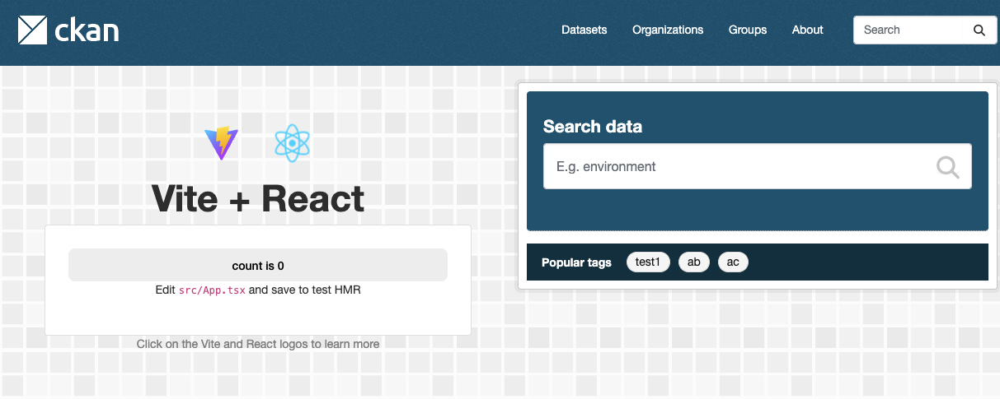

## Why This Article?

We needed a way to preview `.parquet` files, which we have in abundance on one of our projects.

Parquet is a column-oriented file format developed by Apache, designed specifically for efficient data storage and retrieval. It provides high-performance compression and encoding schemes to handle complex data in bulk and is supported by many programming languages and analytics tools.

CKAN already has previews for several tabular formats, but not for Parquet. We discovered **hyparquet**, a JavaScript library that parses Parquet files on the client side. Their demo featured an example built with **hightables**, a React table component designed to efficiently display large datasets in the browser.

The license was permissive and the implementation solid — a perfect starting point. Why reinvent the wheel when we can use existing tools? The challenge? Using React isn't the canonical approach in CKAN.

## The CKAN Way

CKAN has its own [approach](https://docs.ckan.org/en/latest/contributing/frontend/javascript-module-tutorial.html) — CKAN JS modules that are registered with webassets and follow a specific structure.

You create a file like this:

```js
ckan.module('ckanext-react_example', function (jQuery) {
  return {
    initialize: function () {
      this.myBtn = document.getElementById("my-btn");
      this.myBtn.addEventListener("click", this._onMyBtnClick)
    },

    _onMyBtnClick: function () {
      alert("You did it!")
    }
  };
});
```

Register it in `webassets.yml` and create an element that references this module:

```html
<div data-module="ckanext-react_example">
    <button id="my-btn">Hello</button>
</div>
```

When the page loads, a core CKAN script searches for all elements with a `data-module` attribute and initializes these modules. Clicking the button will now trigger an alert.

### The Limitations

The drawback? **No imports**. This is a very restrictive way to define JS modules.

To interact with other JS modules, you must use the `publish/subscribe` methods described in the documentation (essentially signals you emit and listen to).

For third-party JS libraries, you need UMD-style modules — universal modules bundled as a single file. You can't write `import React from 'react';` in a CKAN JS module, and many modern libraries use ESM format. While you could work around this by importing from a CDN inside an `<script type="module">` tag, bundling and serving as a single file and using `window.hyparquet`, it's clunky. And it still won't work with **hightables**.

## Our Solution

Create a small React application bundled with Vite and served as a single module. Then use this module inside a CKAN JS module.

## Step 1: Create a React App with Vite

Thanks to Vite, this is simple. Run this command inside your extension folder:

```bash
npm create vite@latest
```

Follow the prompts:
- Name your project
- Select `React` framework
- Choose `TypeScript + SWC` variant (or JavaScript if you prefer)
- Set `No` for `Use rolldown-vite`
- Set `Yes` for `Install with npm and start now?`

This installs dependencies and starts the dev server immediately:

```bash
  VITE v7.2.4  ready in 370 ms

  ➜  Local:   http://localhost:5173/
  ➜  Network: use --host to expose
  ➜  press h + enter to show help
```

Open `http://localhost:5173/` in your browser to see the default React app.


That's enough for our purposes. Stop the dev server with `Ctrl+C`. If we can embed this app into CKAN, we can embed any React app.

Your project structure should look like this:

```sh
.rw-r--r-- cherry staff 616 B  Tue Nov 25 09:59:30 2025  eslint.config.js
.rw-r--r-- cherry staff 361 B  Tue Nov 25 09:59:30 2025  index.html
drwxr-xr-x cherry staff 4.0 KB Tue Nov 25 09:59:41 2025  node_modules
.rw-r--r-- cherry staff 112 KB Tue Nov 25 09:59:40 2025  package-lock.json
.rw-r--r-- cherry staff 717 B  Tue Nov 25 09:59:30 2025  package.json
drwxr-xr-x cherry staff  96 B  Tue Nov 25 09:59:30 2025  public
.rw-r--r-- cherry staff 2.5 KB Tue Nov 25 09:59:30 2025  README.md
drwxr-xr-x cherry staff 224 B  Tue Nov 25 09:59:30 2025  src
.rw-r--r-- cherry staff 732 B  Tue Nov 25 09:59:30 2025  tsconfig.app.json
.rw-r--r-- cherry staff 119 B  Tue Nov 25 09:59:30 2025  tsconfig.json
.rw-r--r-- cherry staff 653 B  Tue Nov 25 09:59:30 2025  tsconfig.node.json
.rw-r--r-- cherry staff 165 B  Tue Nov 25 09:59:30 2025  vite.config.ts
```

## Step 2: Encapsulate CSS

First, rename `src/index.css` to `src/index.scss` and update the import in `src/main.tsx`:

```ts
import './index.scss'
```

To work with SCSS files, **install the `sass-embedded` package**:

```bash
npm install -D sass-embedded
```

Now you can use **SCSS** syntax. But we still need to ensure our styles don't conflict with CKAN's styles.

We'll mount our React app in a root element, the `id` can be anything, so let's rename it from `root` to something more specific, like `my-react-app`. Update `index.html`:

```html
<div id="my-react-app"></div>
```

And update `main.tsx`, replacing `root` with `my-react-app`.

When we embed this app into CKAN, we'll create a div with `id="my-react-app"` and mount our React app there. We need to scope our styles to this element only.

Open `src/App.scss` and wrap all styles with a root selector:

```scss
#my-react-app {
    ...your existing styles here...
}
```

## Step 3: Configure Vite

**Vite** is a modern build tool that bundles our React app. Open `vite.config.ts`. Currently it looks like this:

```ts
import { defineConfig } from 'vite'
import react from '@vitejs/plugin-react-swc'

// https://vite.dev/config/
export default defineConfig({
  plugins: [react()],
})
```

If you build it now with `npm run build`, you'll get this output:

```sh
> my-react-app@0.0.0 build
> tsc -b && vite build

vite v7.2.4 building client environment for production...
✓ 32 modules transformed.
dist/index.html                   0.46 kB │ gzip:  0.29 kB
dist/assets/react-CHdo91hT.svg    4.13 kB │ gzip:  2.05 kB
dist/assets/index-COcDBgFa.css    1.38 kB │ gzip:  0.70 kB
dist/assets/index--7QIOfZo.js   194.05 kB │ gzip: 60.96 kB
✓ built in 431ms
```

We need to change the build target to a single JS file. Update `vite.config.ts`:

```ts
import { defineConfig } from "vite";
import react from "@vitejs/plugin-react-swc";
import { copyFileSync, mkdirSync, rmSync } from "fs";
import { resolve } from "path";

// https://vite.dev/config/
export default defineConfig({
    plugins: [
        react(),
        {
            name: "move-files",
            closeBundle() {
                const base = "../ckanext/react_example";

                // Ensure destination directories exist
                mkdirSync(resolve(base, "assets/js"), { recursive: true });

                // Move JS files
                copyFileSync(
                    resolve(base, "public/my-react-app/assets/js/my-react-app.min.js"),
                    resolve(base, "assets/js/my-react-app.min.js")
                );

                // Remove public/assets directory
                rmSync(resolve(base, "public/my-react-app/assets"), { recursive: true, force: true });
            },
        },
    ],
    base: "/my-react-app/",
    build: {
        outDir: "../ckanext/react_example/public/my-react-app",
        rollupOptions: {
            input: "src/main.tsx",
            external: [/index\.scss$/],
            output: {
                format: "iife",
                entryFileNames: "assets/js/my-react-app.min.js",
                chunkFileNames: "assets/js/my-react-app.min.js",
                assetFileNames: "[name].[ext]",
                globals: {
                    react: "React",
                    "react-dom": "ReactDOM",
                },
            },
        },
    },
});
```

This might look complicated, but here's what it does:

1. **Custom plugin**: The `move-files` plugin moves the built JS file to our CKAN extension folder after the build completes.
2. **Base path**: Setting `base` to `/my-react-app/` ensures all assets are referenced from this path. This separates our React app assets from other CKAN assets, preventing conflicts.
3. **Output directory**: The `build.outDir` specifies the output location inside our CKAN extension folder.
4. **Rollup options**: We define the input file, mark `index.scss` as external (so it won't be bundled separately into CSS), and configure the output as a single `iife` format file.

Our styles are now embedded in `my-react-app.min.js` due to the IIFE format. They shouldn't conflict with CKAN styles since we scoped them to `#my-react-app`. However, CKAN styles could still override ours, so if needed, use different class names, the `!important` directive, or increase specificity.

## Step 4: Create a CKAN Template to Embed the React App

I won't cover creating a CKAN extension from scratch or registering webassets—you can find this in the [CKAN documentation](https://docs.ckan.org/en/latest/contributing/frontend/assets.html).

Assuming you have an extension ready and your webassets configured, your `webassets.yml` should include:

```yaml
react_example-js:
  filter: rjsmin
  output: ckanext-react_example/%(version)s-react_example.js
  contents:
    - js/my-react-app.min.js
```

Now create a CKAN template where you want to embed your React app. For example, `ckanext-react-example/ckanext/react_example/templates/home/snippets/promoted.html`:

```html
<div id="my-react-app"></div>


```

This replaces the default promoted section on the home page with your React app.

## Result

If everything is set up correctly, you'll see something like this:



As you can see, the React logo and Vite link appear correctly, it means that the assets are loaded.

Although, some CKAN styles still affect our app (e.g. `.card` class). This is expected and pretty easy to fix, so we're not going to cover it here.

Cheers!
