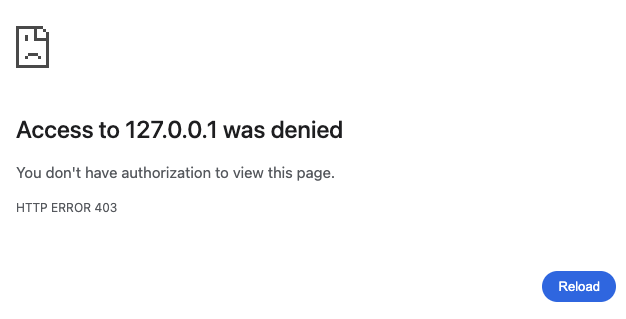
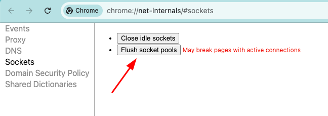
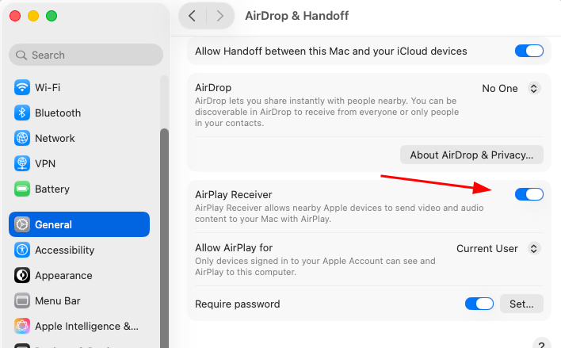

# Debugging Port 5000 Conflicts on macOS: When AirPlay Hijacks Your Development Server

Recently, I switched to my MacBook due to electricity shortages in Ukraine. As a relatively new macOS user, I quickly ran into a frustrating issue while working with CKAN, a Flask-based data management system.

## The Problem

During development, I frequently restart the server, either manually or via auto-reload. It's a typical workflow: change code, refresh the browser, repeat. Sometimes I'd refresh too quickly, before the server fully started, and see an error page. Fair enough.

But here's where it got weird: even after the server started successfully, the page would remain inaccessible. I kept seeing the same error, which I initially assumed was `This site can’t be reached` or something similar.

My first thought was browser caching, maybe it cached the error page? But I'd never experienced that behavior before, and it seemed unlikely.



> In hindsight, a 403 error is pretty unusual when trying to access a server that should be down 🙂.


## The Real Culprit

**macOS uses port 5000 for AirPlay Receiver.**

You can verify what's listening on this port using `netstat`:

```sh
netstat -an | grep 5000
```

Output:
```sh
tcp6       0      0  *.5000                 *.*                    LISTEN
tcp4       0      0  *.5000                 *.*                    LISTEN
tcp4       0      0  127.0.0.1.5000         *.*                    LISTEN
```

Or with `lsof`:

```sh
lsof -i :5000
```

Output:
```sh
COMMAND    PID   USER   FD   TYPE             DEVICE SIZE/OFF NODE NAME
ControlCe  697 cherry   11u  IPv4  0xcb15211adc8f0f6      0t0  TCP *:commplex-main (LISTEN)
ControlCe  697 cherry   12u  IPv6 0xb8560ad8849d6df3      0t0  TCP *:commplex-main (LISTEN)
python3.1 8628 cherry   13u  IPv4 0xe8adf52b8a9b48da      0t0  TCP localhost:commplex-main (LISTEN)
python3.1 8630 cherry   13u  IPv4 0xe8adf52b8a9b48da      0t0  TCP localhost:commplex-main (LISTEN)
python3.1 8630 cherry   17u  IPv4 0xe8adf52b8a9b48da      0t0  TCP localhost:commplex-main (LISTEN)
```

Notice `ControlCenter`? That's the AirPlay service. When my development server tried to bind to port 5000, AirPlay would sometimes win the race, causing the browser to maintain a connection to the wrong service.

## Quick Fix: Flush Socket Pools

If you're using Chrome, you can temporarily resolve this by flushing the socket pools:

1. Navigate to `chrome://net-internals/#sockets`
2. Click "Flush socket pools"



Unfortunately, I haven't found a comparable solution for Firefox or Safari. Regardless, this is just a temporary workaround, not a long-term solution.

## Permanent Solutions

### Option 1: Disable AirPlay Receiver

If you don't use AirPlay, simply disable it:

1. Open **System Settings**
2. Go to **General** → **AirDrop & Handoff**
3. Turn off **AirPlay Receiver**



### Option 2: Change Your Application Port

Configure your development server to use a different port (like 5001, 8000, or 3000. Just check if the port is free...). This is the safer approach if you need AirPlay functionality.

## My Solution

Since I don't use AirPlay and have numerous projects configured for port 5000, I opted to disable the AirPlay Receiver entirely.

---

**Takeaway:** If you're a macOS developer experiencing mysterious port 5000 conflicts, check if AirPlay is the culprit.

Cheers!
