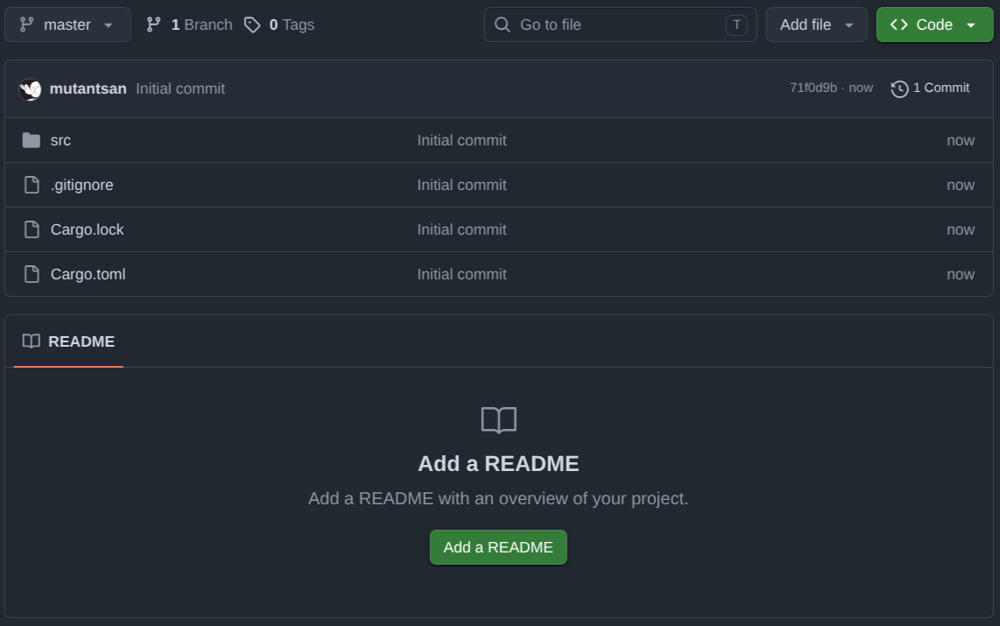
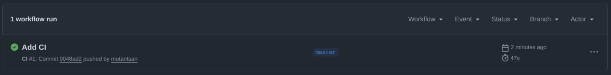
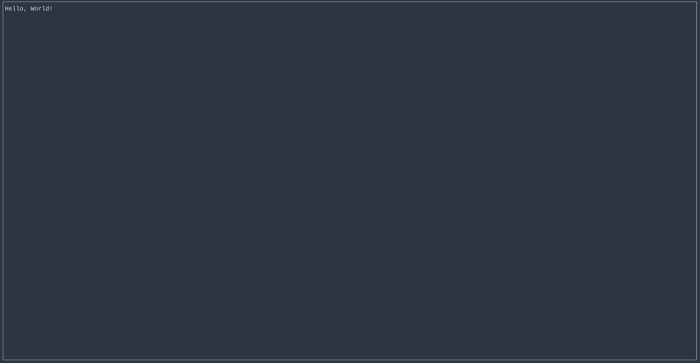
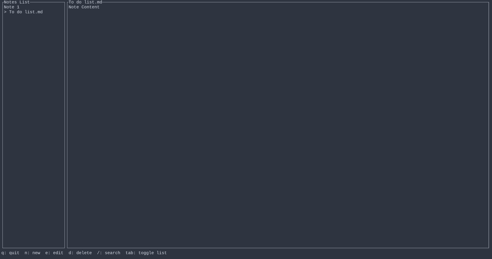

# Starting from scratch

In a series of posts, I'll show you how to create a TUI with Rust and Ratatui. The goal is to create a simple note-taking app.

## Prerequisites

I assume you have a working Rust installation. If not, you can find the installation instructions [here](https://www.rust-lang.org/tools/install). Usually, you install the `rustup` tool, which is the official installer and version management tool for the Rust Programming Language.

`rustup` installs and manages the Rust toolchain, which includes:

- rustc — compiler
- cargo — package manager/build tool
- rustfmt — formatter
- clippy — linter
- rustdoc — documentation generator

## Initialize the project

First of all, we need to initialize the project. We will use the `cargo new` command to create a new project.

```bash
cargo new scrap
cd scrap
```

Then let's add the `ratatui` and `crossterm` dependencies to the `Cargo.toml` file. It's a manifest file that contains all the project's dependencies, configuration and general information about the project.

```
cargo add ratatui
cargo add crossterm
```

Now the `Cargo.toml` file should roughly look like this:

```toml
[package]
name = "scrap"
version = "0.1.0"
edition = "2024"

[dependencies]
crossterm = "0.29.0"
ratatui = "0.30.2"
```

Then it's a good idea to immediately set up the standard Rust quality tools:

```bash
rustup component add clippy rustfmt
```

Finally, we're going to initialize the git repository.

```bash
git remote add origin git@github.com:mutantsan/scrap.git
git add .
git commit -m "Initial commit"
git push -u origin master
```



## Create a GitHub Actions workflow

We're going to use GitHub Actions to automate the build and test process. For now, we'll just create a basic workflow that runs on every push to any branch.

```sh
mkdir -p .github/workflows
touch .github/workflows/ci.yml
```

Put this into the `ci.yml` file:

```yaml
name: CI

on:
  push:
  pull_request:

jobs:
  check:
    runs-on: ubuntu-latest

    steps:
      - name: Checkout
        uses: actions/checkout@v4

      - name: Install Rust
        uses: dtolnay/rust-toolchain@stable
        with:
          components: rustfmt, clippy

      - name: Check formatting
        run: cargo fmt -- --check

      - name: Clippy
        run: cargo clippy --all-targets --all-features -- -D warnings

      - name: Tests
        run: cargo test
```

Then commit and push the changes to the repository.

```sh
git add .
git commit -m "Add CI"
git push
```

Now every push will trigger the CI workflow - which will run the tests, check formatting and lint the code.
The `dtolnay/rust-toolchain@stable` action is a commonly used GitHub Action for installing the latest stable Rust toolchain. It uses rustup under the hood, so you don't need to manually install Rust in the CI environment.



## Planning our TUI

First, let's plan how our TUI application will look. I propose to keep it simple.

```txt
┌────────┬──To do list.md────────────────────────────┐
│        │ Note Content                              │
│  Notes │                                           │
│  List  │                                           │
│        │                                           │
│        │                                           │
│        │                                           │
│        │                                           │
├────────┴───────────────────────────────────────────┤
│  q: quit  n: new  e: edit  /: search  tab: toggle  │
└────────────────────────────────────────────────────┘
```

We will have a togglable sidebar with a list of notes. The list will be narrow and scrollable. The content of the note will be bigger and scrollable. And at the bottom, we will have a status bar with some shortcuts.

The status bar will probably have a few more shortcuts, but we'll get to that later.

You might be wondering, why even bother with this app, when you can just use `vim` and write your notes there? I'd suggest thinking about it as a learning exercise. You'll learn a lot about the Rust ecosystem and how to build a TUI application.

### About TUI applications

Before touching code, it helps to understand how a TUI application is structured. None of this is specific to Rust or ratatui — it's the same shape in different languages or libraries:

1. **Setup and teardown**. A terminal normally works line-by-line: it waits for Enter, echoes what you type, treats Ctrl+C as "quit". A TUI needs the opposite — every keypress delivered instantly, nothing echoed, the screen fully under our control. So on startup we switch the terminal into raw mode and an alternate screen (the separate buffer vim and less use). On exit we must undo both, or we leave the user with a broken shell.

2. **The main loop**. The heart of the app. It runs until the user quits, and each turn it does two things: draw the current screen, then wait for an event (a keypress) and update the app's state in response. Draw, wait, react — repeat.

3. **Rendering is a function of state**. We don't mutate widgets on screen. We keep our own data — the notes, which one is selected — and on every loop turn we redraw the whole screen from scratch based on that data. Want the UI to change? Change the state; the next frame reflects it. (If you've used React, this is the same "UI as a function of state" idea.)

## Writing our first Rust program

There's a `main.rs` file inside the `src` directory. It currently looks like this:

```rust
fn main() {
    println!("Hello, world!");
}
```

And technically, it is a valid Rust program. The `main.rs` file is the binary crate root. Cargo compiles the crate starting here. The `fn main()` is the entry point of the program.

But we want something more interesting than that. The first iteration of our TUI will look like this:

```rust
use ratatui::{
    widgets::{Block, Paragraph},
    text::Text,
};
use std::{thread, time::Duration};

fn main() {
    let mut terminal = ratatui::init();

    terminal
        .draw(|frame| {
            let text = Text::raw("Hello, World!");
            let paragraph = Paragraph::new(text).block(Block::bordered());
            frame.render_widget(paragraph, frame.area());
        })
        .expect("failed to draw frame");

    thread::sleep(Duration::from_secs(5));

    ratatui::restore();
}
```

At the top we have the `use` statements. Basically, we're importing some stuff from the `ratatui` library and a few other things from the standard library.

The `ratatui::init()` function initializes the terminal and returns a `DefaultTerminal` object. This object is a wrapper around the `crossterm` library, which is used to control the terminal. It also enters raw mode and switches to the alternate screen.

The `terminal.draw(|frame| { ... })` does one render pass. We hand it a closure (somewhat similar to Python's `lambda` function) that takes a mutable reference to the `Frame` object.

The `Paragraph::new(text).block(Block::bordered())` makes a bordered rectangle with text inside.

Then the `frame.render_widget(paragraph, frame.area())` places that rectangle on the screen, taking the whole terminal area.

Finally, we sleep for 5 seconds and restore the terminal. For now we don't have a loop, so we just sleep for a while and then exit. Just run the `cargo run` command. You should see the following output:



### Second iteration

Let's add a loop to our app and key handling.

```rust
use crossterm::event::{self, Event, KeyCode};
use ratatui::{
    text::Text,
    widgets::{Block, Paragraph},
};

fn main() {
    let mut terminal = ratatui::init();
    let mut counter = 0;

    loop {
        terminal
            .draw(|frame| {
                let text = Text::raw(format!("Hello, World! Press q to quit. Counter: {}", counter));
                let paragraph = Paragraph::new(text).block(Block::bordered());
                frame.render_widget(paragraph, frame.area());
            })
            .expect("failed to draw frame");

        if let Event::Key(key) = event::read().expect("failed to read event") {
            if key.code == KeyCode::Char('q') {
                break;
            }
        }

        counter += 1;
    }

    ratatui::restore();
}
```

What changed:

- `loop { ... }` — Rust's `while True:`. Runs forever until `break` is called.
- `event::read()` — **blocks** until something happens (keypress, resize, paste...) and returns an Event.
- `if let Event::Key(key) = ...` — pattern matching: "if this event is specifically a Key event, unpack it into key, otherwise skip this iteration." Rust's Event is an enum (like a Python Enum, but each variant can carry its own data) — `Event::Key(KeyEvent)`, `Event::Resize(...)`, etc. `if let` is the shorthand for "match one case, ignore the rest."
- `key.code == KeyCode::Char('q')` — KeyCode is another enum: `Char('q')`, Esc, Enter, arrow keys, etc. We're checking "was the key the letter q".
- break — exits the loop, falls through to ratatui::restore().

> [!WARNING] Important
> As you can see, the `event::read()` function blocks the thread. To understand it better, I've added a `counter` into the output message. Try pressing any key except `q`, and you'll see that the `counter` increments each time. It can easily bite you if you don't handle it properly. If you ever want something to happen without a keypress — a clock tick, an autosave timer, a blinking cursor — a blocking read() would freeze that too.

### Third iteration

Let's add a mock of the app skeleton.

```rust
use crossterm::event::{self, Event, KeyCode};
use ratatui::{
    layout::{Constraint, Layout},
    text::Text,
    widgets::{Block, List, Paragraph},
};

fn main() {
    let mut terminal = ratatui::init();

    loop {
        terminal
            .draw(|frame| {
                let area = frame.area();

                let [main_area, status_area] =
                    Layout::vertical([Constraint::Min(0), Constraint::Length(1)]).areas(area);

                let [list_area, content_area] =
                    Layout::horizontal([Constraint::Length(25), Constraint::Min(0)])
                        .areas(main_area);

                let list =
                    List::new(["Note 1", "> To do list.md"]).block(Block::bordered().title("Notes List"));
                let content = Paragraph::new(Text::raw("Note Content"))
                    .block(Block::bordered().title("To do list.md"));
                let status = Paragraph::new(
                    "q: quit  n: new  e: edit  d: delete  /: search  tab: toggle list",
                );

                frame.render_widget(list, list_area);
                frame.render_widget(content, content_area);
                frame.render_widget(status, status_area);
            })
            .expect("failed to draw frame");

        if let Event::Key(key) = event::read().expect("failed to read event") {
            if key.code == KeyCode::Char('q') {
                break;
            }
        }
    }

    ratatui::restore();
}
```

New pieces:

- `Layout::vertical([...]).areas(area)` — splits one Rect into pieces stacked top-to-bottom, sized by the `Constraints` you give. `.areas()` returns them as a fixed-size array, which you destructure straight into named variables `([main_area, status_area])`.
- `Constraint::Min(0)` — "take at least 0, but grab whatever space is left over." `Constraint::Length(1)` — "exactly 1 row, no more, no less." So the main area gets everything, and the status bar gets exactly 1 line at the bottom.
- Same idea again, but `Layout::horizontal`, splitting `main_area` into a 25-column-wide list pane and a content pane taking the rest.
- `List::new([...])` — a scrollable list widget; for now just static strings, no selection logic yet.
- Three render_widget calls per frame instead of one — each widget drawn into its own `Rect`.



## Results

For now, the app is pretty useless. It's just a skeleton, but we covered a few important steps of initialization and event handling.
