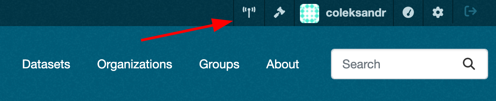
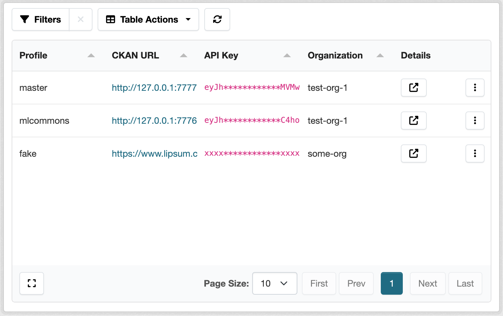
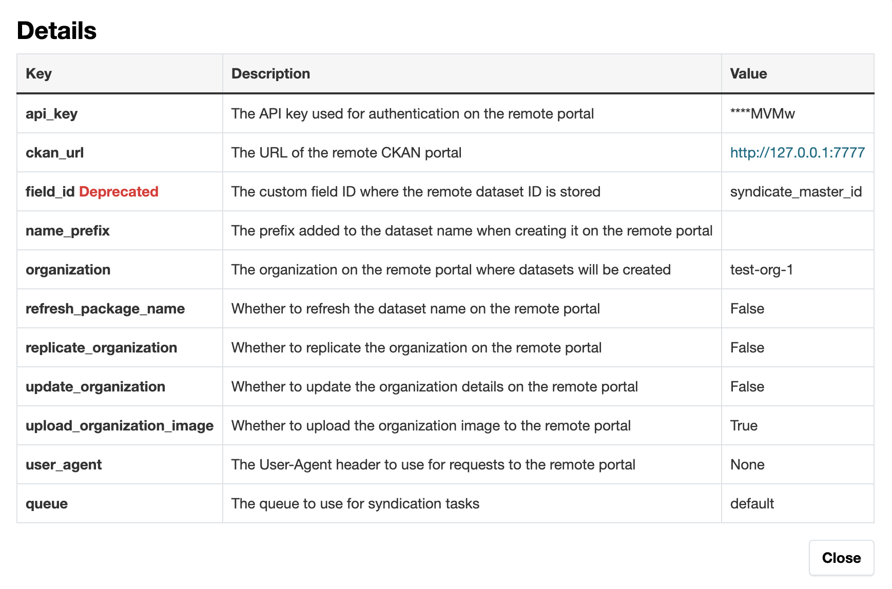
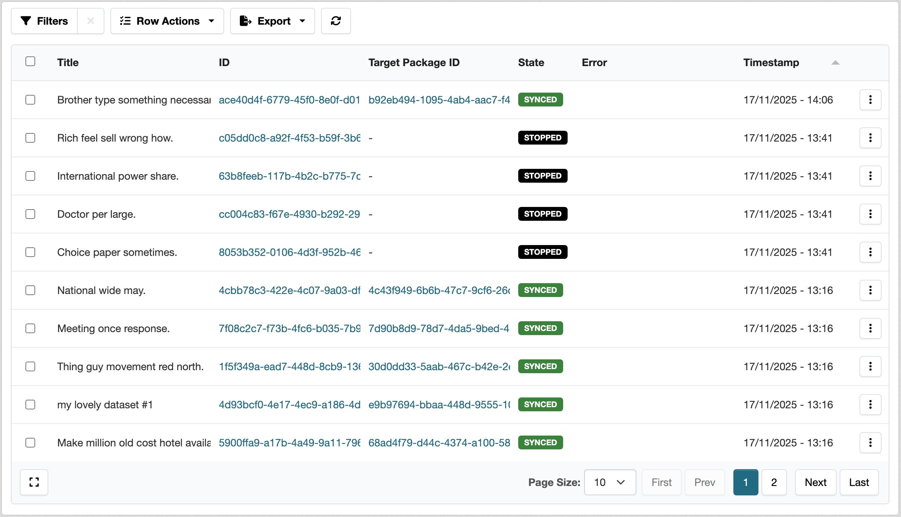

# Announcing Syndication 3.0.0: Major Update for CKAN Extension

## Introduction

The `ckanext-syndicate` extension has been updated to version 3.0.0. This major release brings a complete overhaul, from internal code and tests to an entirely new user interface.

Syndicate's primary goal is to push datasets to remote portals, enabling a single data provider to distribute data across multiple open-data portals. Portal maintainers specify profiles that represent remote portals. Each profile contains information about the remote CKAN instance, authentication credentials, and other configuration settings.

**The main issue we aimed to solve was the lack of observability**. Previously, syndication happened in background jobs with output written only to log files. Users initiating the sync process from the web UI were often unaware of the outcome.

The process complexity stems from several factors, primarily remote portal availability and dataset schema differences. Changes to a schema on a remote portal can break syndication. Similarly, modifying data on the source portal may trigger incompatibility with the remote portal's schema.

These issues need to be obvious and easily resolvable. To track every syndication record, we've created a web UI (available only to sysadmins) that helps you monitor all enabled profiles and their records.

## Syndication Profiles Dashboard

You can access the syndication profile dashboard by clicking the button in the header next to your profile name.



Clicking the button opens the dashboard with all profiles listed. On this page, you can see the profile name, remote portal URL, and all other profile-related data. The dashboard table is powered by the [`ckanext-tables`](https://github.com/DataShades/ckanext-tables) extension, which allows us to build complex tables with sorting, filtering, and pagination quickly and easily.



Because each profile contains extensive information, we've added a button in the **Details** column that opens a modal window showing all profile information. Here you can verify whether the API key is set, view the remote portal URL, check the profile queue name, and review other settings.



## Syndication Records Dashboard

From the syndication dashboard, you can access the records dashboard by clicking the button with three dots and selecting **View logs**. This opens a new page displaying all records related to the profile.



The records dashboard contains all records associated with the profile. Each record represents a dataset that was or wasn't successfully syndicated to the remote portal. You can see the dataset title, local and remote IDs (if syndicated successfully), state (synced, failed, stopped), error message (if any), and timestamp.



The `ckanext-tables` extension enables you to filter records, apply actions to selected records (such as resyndicating selected packages), and export records in different formats: CSV, JSON, Excel, TSV, YAML, NDJSON, HTML, and PDF. You can also resyndicate a single record by clicking the respective button in the three-dots menu.

### Syndication States

A syndication record can have several states:

- **Synced** - the dataset was successfully syndicated to the remote portal.
- **Failed** - the syndication process failed due to an error. The error message is displayed in the respective column.
- **Stopped** - the syndication process was stopped by the `skip_syndication` hook. This can occur when a dataset shouldn't be syndicated based on certain conditions.

### Resyndication

The new UI makes resyndication much easier. You can resyndicate a single record, selected records, or an entire profile.

When you resyndicate a record, a new task is created in the background queue. To ensure resyndication isn't blocked by other tasks, we've added a `queue` setting to each profile. This allows multiple profiles to work in parallel without blocking each other. By default, the `default` queue is used.

## Migration Guide

Here are the steps to migrate to `ckanext-syndicate` 3.0.0:

### 1. Update Plugin Configuration

The `ckan.plugins` setting now requires adding `tables` alongside `syndicate`, as the extension relies on `ckanext-tables` for the dashboards.

```ini
ckan.plugins = ... syndicate tables ...
```

### 2. Run Database Migration

Run the database migration command to create the new table for syndication records:

```bash
ckan -c /path/to/your/ckan.ini db upgrade
```


**Note:** Previously, we stored the remote dataset ID in the `field_id` field in dataset extras. Now, all syndication records are stored in a separate table, so this setting is no longer needed for new syndications. However, you must keep it for existing datasets during the migration period, as it will be used to backfill the records table.


### 3. Update Configuration Settings

Update your `ckan.ini` configuration file to include the new settings for `ckanext-syndicate`. Refer to the [documentation](https://github.com/DataShades/ckanext-syndicate?tab=readme-ov-file#config-settings) for the complete list of settings.

### 4. Configuration Option Changes

**Removed settings:**
- `ckanext.syndicate.queue.name` - replaced by per-profile queue settings
- `ckanext.syndicate.profile.<PROFILE>.author`

**Added settings:**
- `ckanext.syndicate.profile.<PROFILE>.queue` - the name of the queue to use for syndication tasks (default: `default`)

**Deprecated settings:**
- `ckanext.syndicate.profile.<PROFILE>.field_id` - deprecated but **must remain** during the database migration period. This setting will be removed in future releases.

### 5. Removed Helpers

The following helpers have been removed:
- `organization_owns_dataset`
- `organization_not_owns_dataset`

### 6. Removed Interface Methods

The following interface method has been removed:
- `ISyndication.reattach_on_syndication_error`

### 7. Removed Utility Functions

The following utility functions have been removed:
- `try_sync`
- `get_target`
- `trigger_sync`

### 8. Deprecated Actions Removed

Previously deprecated actions have been removed. Use signals instead:
- `before_syndication_action`
- `after_syndication_action`
- `update_dataset_for_syndication`

### 9. Requirements Updates

- Python >= 3.10
- CKAN >= 2.10

## Conclusion

Syndication 3.0.0 represents a significant step forward in making dataset syndication more transparent, manageable, and reliable. The new dashboards provide unprecedented visibility into syndication operations, while the improved architecture ensures better performance and maintainability.

We encourage all users to migrate to this new version and explore the enhanced features. For questions or issues during migration, please visit our [GitHub repository](https://github.com/DataShades/ckanext-syndicate) or reach out to the [community](https://app.gitter.im/#/room/#ckan_chat:gitter.im).
